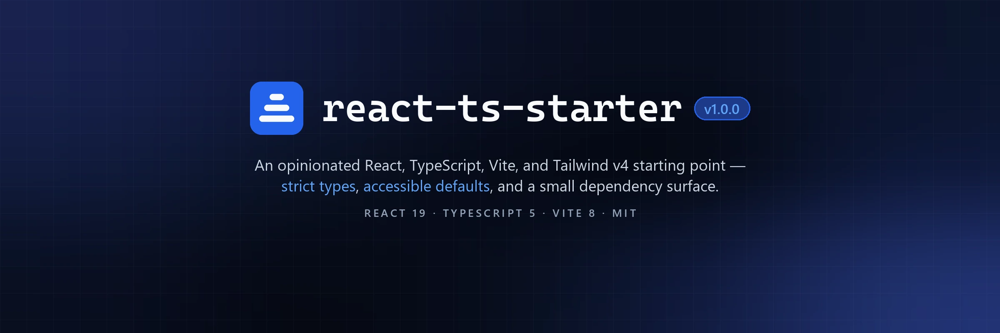

# React TS Template

[](https://github.com/IanSkelskey/react-ts-starter/actions/workflows/ci.yml)

Opinionated starting point for React + TypeScript + Vite + Tailwind v4 projects. Distilled from the shared patterns in production apps — biased toward accessibility, strict types, and a small dependency surface.

<div align="center">
<table>
  <tr>
    <td align="center" width="140">
      <br />
      <b>React</b><br />19
    </td>
    <td align="center" width="140">
      <br />
      <b>TypeScript</b><br />5
    </td>
    <td align="center" width="140">
      <br />
      <b>Vite</b><br />8
    </td>
    <td align="center" width="140">
      <br />
      <b>Tailwind</b><br />v4
    </td>
  </tr>
</table>
</div>

## What's inside

- **React 19 + TypeScript 5 + Vite 8** with strict `tsconfig`.
- **Tailwind CSS v4** via `@tailwindcss/vite`. Tokens live in `@theme` in `src/index.css`.
- **Semantic color tokens** (`text-foreground`, `bg-raised`, `text-accent`, etc.) with automatic dark mode via `prefers-color-scheme` — no `dark:` variants.
- **Global a11y baselines**: `prefers-reduced-motion` and `forced-colors` overrides; visible `:focus-visible` ring.
- **React Router v7** with **route-level code splitting** (`React.lazy` + shared `<Suspense>` fallback).
- **`ErrorBoundary`** with optional `resetKey` for route-reset behavior.
- **`useDocumentTitle`** hook — the only approved way to set `document.title`.
- **`fetchWithTimeout`** utility with `AbortController` + external-signal chaining.
- **`src/config/env.ts`** as the single place to read `VITE_*` variables.
- **Single `src/types/index.ts`** — no per-domain type files.
- **Verify pipeline** — `prettier-check → lint → typecheck → build`, wired into GitHub Actions.
- **GitHub Pages deploy workflow** — publishes `dist/` on every push to `main`.
- **Documented conventions** in [.github/copilot-instructions.md](.github/copilot-instructions.md).

Every one of the above is exercised at least once by the demo app, so nothing ships as dead code. The `/demo` route is the showcase — see [Removing the demo](#removing-the-demo).

## Getting started

```bash
# 1. Use this template on GitHub (or clone and re-init git)
npm install

# 2. Copy env template and fill in any VITE_* variables
cp .env.example .env.local

# 3. Start developing
npm run dev
```

Run `npm run verify` before committing — it is the same chain CI runs. See [CONTRIBUTING.md](CONTRIBUTING.md) for the full script list, project layout, and conventions.

## Removing the demo

The `/demo` route exists so every built-in renders at least once — the template ships no dead code. To strip it:

1. Delete `src/pages/DemoPage.tsx` and `public/demo-data.json`.
2. Remove the `DemoPage` import, its `<Route>`, the `Demo` `<NavLink>` in `Layout.tsx`, and the closing paragraph in `HomePage.tsx`.
3. Drop `DemoStatus` from `src/types/index.ts`.

Keep the route-level `<ErrorBoundary resetKey={location.pathname}>` in `App.tsx` — it is part of the shell, not the demo.

## Deploying to GitHub Pages

The template ships with [`.github/workflows/deploy.yml`](.github/workflows/deploy.yml), which builds and publishes `dist/` on every push to `main`.

1. In your repo, go to **Settings → Pages** and set **Source** to **GitHub Actions**.
2. Push to `main`. The workflow builds with `BASE_PATH=/<repo>/` so assets resolve correctly for a project page (e.g. `https://<user>.github.io/<repo>/`).
3. Deep links (e.g. a hard refresh on `/demo`) survive via the [rafgraph SPA redirect trick](https://github.com/rafgraph/spa-github-pages):
   - `dist/404.html` is generated at build time by the `spa-github-pages-404` plugin in [vite.config.ts](vite.config.ts), with the resolved `base` baked into it. GitHub serves it for any unknown path; it encodes the requested path into a query string and bounces to `index.html`, which IS served with a 200.
   - A small script inlined in the `<head>` of [index.html](index.html) decodes that query string before React boots. Both halves are inline, so neither costs a request.

This adapts to the base path automatically — there is nothing to hand-edit for a project page, a user page, or a custom domain.

> **Why generated, not `public/404.html`?** Vite copies `public/` verbatim and never rewrites paths inside it. A `<script src="/scripts/…">` there resolves against the domain root, so on a project page served from `/<repo>/` it 404s and the redirect silently dies.

**User/organization page** (`<user>.github.io`) or **custom domain**: override `BASE_PATH` to `/` in the workflow, or edit the default in [vite.config.ts](vite.config.ts). Nothing else changes.

**Project page** (`<user>.github.io/<repo>/`): nothing to configure — the workflow derives `BASE_PATH` from the repo name.

`BrowserRouter` uses `BASE_PATH` from [src/config/env.ts](src/config/env.ts) as its `basename`, so routing works under any base path without further changes.

## Contributing

See [CONTRIBUTING.md](CONTRIBUTING.md).

## License

MIT. Replace this section when you fork the template.
